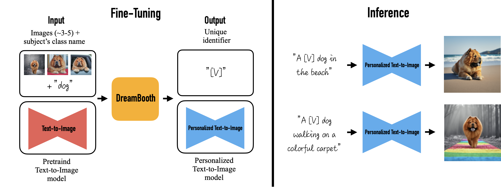

# Sumário:
* [Criando avatares com IA](#criando-avatares-com-ia)
* [Criando Imagens Diversas](#criando-imagens-diversas)
* [Por trás dos panos](#por-trás-dos-panos)
* [Comece a criar](#comece-a-criar-suas-imagens)
* [Conheça mais](#conheça-mais)
* [créditos](#créditos)

# Criando avatares com IA

Recentemente tivemos um *BOOM* gigante no uso de inteligências artificiais que geram imagens. Primeiro tivemos os modelos da [OpenAI](https://openai.com/), os famosos [DALL-E](https://openai.com/blog/dall-e/) e [DALL-E 2](https://openai.com/dall-e-2/), depois surgiram o [Midjourney](https://www.midjourney.com/) e o [Stable Diffusion](https://stability.ai/blog/stable-diffusion-v2-release).\
Por sua vez as BigTechs também não poderiam ficar de fora, com a [Meta](https://www.meta.com/) anunciando o [Make-A-Video](https://makeavideo.studio/), modelo treinado para criar vídeos a partir de uma imagem, e a Google com o [Stable DreamFusion](https://github.com/ashawkey/stable-dreamfusion), modelo que cria objetos em 3D.

### *Realmente 2022 foi o ano da IA gerando arte.*

A partir desses modelos, e suas APIs, vários desenvolvedores começaram a criar vários apps para smartphone que automatizam o uso deles. Nessa última semana de novembro de 2022, um app que ficou muito famoso foi o [Lensa](https://apps.apple.com/br/app/lensa-editor-de-fotos/id1436732536), criado pela `Prisma Labs`, mesma empresa que criou o app [Prisma](https://apps.apple.com/br/app/prisma-photo-editor-filters/id1122649984), app semelhante ao `Lensa`, só que mais voltado para a edição de imagens com IA.\
Infelizmente o `Lensa` é pago, mas se você também estava curioso para testar essa IA, fique calmo, a IA em si é open-source, gratuita e não precisa de tanto conhecimento para utilizá-la.

## Criando Imagens Diversas

Se você não tem computador, ou ele não é muito potente, uma saída é utilizar os `modelos em nuvem` da `OpenAI` ou o `Midjourney`.

Os modelos `DALL-E` da `OpenAI` estão agora abertos para o público, sendo assim, você pode entrar [nesse site](https://openai.com/dall-e-2/) se registar e começar a usar, um único detalhe é que esse modelo possui algumas restrições em relação a rostos, marcas, etc. Sendo assim alguns prompts que você utilizar podem sair meio distorcidos. Além disso você não possui prompts ilimitados, a `OpenAI` te dá um espécie de crédito todo mês (referente a quantidade de prompts disponíveis) e caso queira utilizar mais neste mês, você terá de pagar uma certa taxa. Para mais detalhes leia a [documentação](https://github.com/openai/dalle-2-preview/blob/main/system-card.md).

Já no caso do `Midjourney`, ele é baseado em um bot de `Discord`, sendo assim, crie uma conta no `Discord`, entre no [site deles](https://www.midjourney.com/) siga as instruções que eles te passam e se divirta :)

Agora, se maquina disponível não é um problema para você, o recomendável é utilizar o `StableDiffusion`, para mais detalhes de uma olhada no [site deles](https://stability.ai/blog/stable-diffusion-v2-release) e também no [github da Stability-AI](https://github.com/Stability-AI/stablediffusion).

## Por trás dos panos

Agora que você conhece alguns dos modelos que estão sendo usados hoje, vamos começar a criar alguns `Avatares`.

Como citado antes, o `Lensa` utiliza um modelo open-source, no caso o `Stable Diffusion`, utilizando um técnica, chamada de [DreamBooth](https://dreambooth.github.io/), que de maneira resumida, pega algumas imagens de entrada e a classe dessas imagens, e a partir disso ele gera um modelo personalizado de `text-to-image`, com isso você pode utilizar esse modelo para gerar imagens personalizadas a partir das entradas que você passou para ele antes.

Com isso então, podemos utilizar um modelo já treinado para fazer nossas imagens, aqui utilizaremos um `fork` [do modelo dísponivel no Github do huggingface](https://github.com/huggingface/diffusers) criado pelo [ShivamShrirao](https://github.com/ShivamShrirao), do qual você pode encontrar [aqui](https://github.com/ShivamShrirao/diffusers).

## Comece a criar suas imagens

Para começar o tutorial, clique nesse botão abaixo

Se você está procurando o tutorial antigo [clique aqui](./old-tutorial/readme.md)

## Conheça mais

Se você se interessar por essas inteligências artificiais, de uma olhada nessa lista de repositórios que criei.\
Nela você encontrará ferramentas, modelos e outros apanhados de repositórios úteis.
[Lista de repositórios](https://github.com/stars/Dpbm/lists/generate-images-ai)

## Créditos

Fiz esse tutorial após ver [alguns stories](https://www.instagram.com/stories/highlights/18303061516074788/) da [Gi Bordignon](https://www.instagram.com/spacecoding/)(aka spacecoding), por favor, dê uma olhada nos perfis dela, vale a pena ;)
