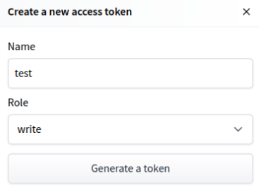
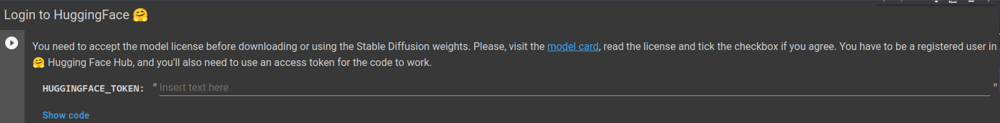
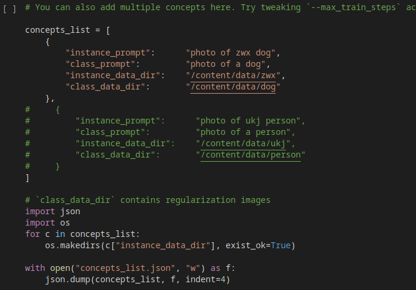
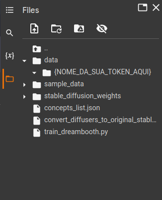
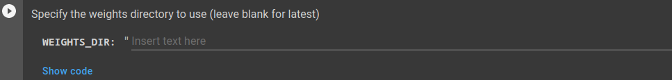
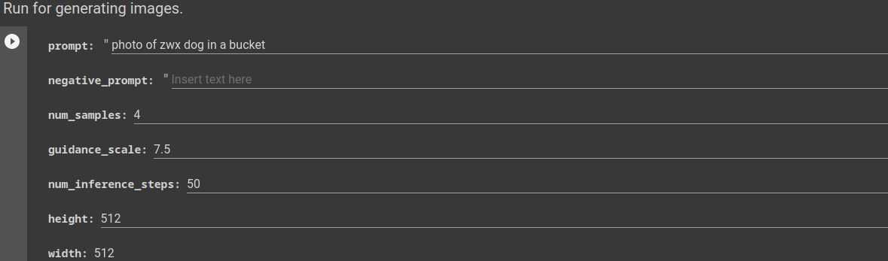

# Criando avatares com I.A.

Recentemente tivemos um BOOM gigante no uso de inteligências artificiais que geram imagens. Primeiro tivemos os modelos da [OpenAI](https://openai.com/), os famosos [DALL-E](https://openai.com/blog/dall-e/) e [DALL-E 2](https://openai.com/dall-e-2/), depois surgiram o [Midjourney](https://www.midjourney.com/) e o[Stable Diffusion](https://stability.ai/blog/stable-diffusion-v2-release). Por sua vez as BigTechs também não poderiam ficar de fora, com a [Meta](https://www.meta.com/) anunciando o [Make-A-Video](https://makeavideo.studio/), que é semelhante aos outros modelos, mas dessa vez ele cria um vídeo a partir de uma imagem e a Google com o [Stable DreamFusion](https://github.com/ashawkey/stable-dreamfusion), modelo que cria objetos em 3D. Realmente 2022 foi o ano da IA gerando arte.

A partir desses modelos e suas APIs, vários desenvolvedores começaram a fazer vários apps para smartphone que automatizam o uso dessas IAs. Nessa última semana de novembro de 2022, um app que ficou muito famoso foi o [Lensa](https://apps.apple.com/br/app/lensa-editor-de-fotos/id1436732536) criado pela `Prisma Labs`, mesma empresa que tem o app [Prisma](https://apps.apple.com/br/app/prisma-photo-editor-filters/id1122649984), que em suma tinha uma ideia semelhante ao `Lensa` só que era mais voltado para a edição e não geração de imagens. Infelizmente o `Lensa` é pago, mas se você também estava curioso para testar essa IA, fique calmo, a IA em si é open-source, gratuita e não precisa de tanto conhecimento para utilizá-la.

Mas, antes de botar a mão na massa, vamos primeiro conhecer alguns modelos e como você pode usá-los.

## Criando Imagens Diversas

Se você não tem computador, ou ele não é muito potente, uma saída é utilizar os `modelos em nuvem` da `OpenAI` ou o `Midjourney`.

Os modelos `DALL-E` da `OpenAI` estão agora abertos para o público, sendo assim, você pode entrar [nesse site](https://openai.com/dall-e-2/) se registar e começar a usar, um único detalhe é que esse modelo possui algumas restrições em relação a rostos, marcas, etc. Sendo assim alguns prompts que você utilizar podem sair meio distorcidos de alguma forma. Além disso você não tem prompts ilimitados, a `OpenAI` te dá um espécie de crédito todo mês(referente a quantidade de prompts disponíveis) e caso queira utilizar mais e não quiser esperar o próximo mês para recarregar você terá de pagar uma certa taxa. Para mais detalhes leia a [documentação](https://github.com/openai/dalle-2-preview/blob/main/system-card.md).

Já no caso do `Midjourney`, ele é baseado em um bot de `Discord`, sendo assim, crie uma conta no `Discord`, entre no [site deles](https://www.midjourney.com/) siga as instruções que eles te passam e se divirta :)

Agora, se maquina disponível não é um problema para você, o recomendável é utilizar o `StableDiffusion`, para mais detalhes de uma olhada no [site deles](https://stability.ai/blog/stable-diffusion-v2-release) e também no [github da Stability-AI](https://github.com/Stability-AI/stablediffusion).

## Avatares

Agora que você conhece alguns do modelos que estão sendo usados hoje, vamos começar a criar alguns `Avatares`.

Como citado antes, o `Lensa` utiliza um modelo open-source, no caso o `Stable Diffusion`, utilizando um técnica, chamada de [DreamBooth](https://dreambooth.github.io/), que de maneira resumida, pega algumas imagens de entrada e a classe dessas imagens, e a partir disso ele gera um modelo personalizado de `text-to-image`, com isso você pode utilizar esse modelo para gerar imagens personalizadas a partir das entradas que você passou para ele antes.

[](https://dreambooth.github.io/)

Com isso então, podemos utilizar um modelo já treinado para fazer nossas imagens, aqui utilizaremos um `fork` [do modelo dísponivel no Github do huggingface](https://github.com/huggingface/diffusers) criado pelo [ShivamShrirao](https://github.com/ShivamShrirao), do qual você pode encontrar [aqui](https://github.com/ShivamShrirao/diffusers).


### Fazendo o Avatar

1) Antes de tudo, tire por volta de `20 fotos suas`, tente enriquecer os detalhes do seu rosto melhorando a iluminação, tirando fotos em vários ângulos, várias poses, etc.

2) Com as fotos tiradas você deve padronizá-las em um tamanho de `512x512 px`, para deixá-las dessa forma você pode usar [photoshop](https://www.adobe.com/br/products/photoshop.html), [gimp](https://www.gimp.org/), [imagemagick](https://imagemagick.org/index.php), ou quaisquer outros editores e ferramentas disponíveis, eu acabei usando um site chamado [birme](https://www.birme.net/?target_width=512&target_height=512), por agilizar a centralização do rosto.

3) Crie uma conta no [HuggingFace](https://huggingface.co/join)

4) Crie uma token no [HuggingFace](https://huggingface.co/settings/tokens), colocando um nome qualquer para ela e dando a permissão de `escrita(write)` (lembre-se de copiar a token e o nome dela, depois vamos usar essas informações no modelo)



5) Entre [aqui](https://huggingface.co/runwayml/stable-diffusion-v1-5) e clique em aceitar, nessa parte você permite que o modelo interaja com sua conta do `HuggingFace`

6) Abra o modelo no [Google Colab](https://colab.research.google.com) clicando no botão ao lado
[](https://colab.research.google.com/github/ShivamShrirao/diffusers/blob/main/examples/dreambooth/DreamBooth_Stable_Diffusion.ipynb)

7) coloque sua token criada no `HuggingFace` aqui:


8) chegando nessa parte:



mude o código para esse abaixo (lembre de trocar o {NOME_DA_SUA_TOKEN_AQUI} para o nome que você colocou na sua token do `HuggingFace`)

```python
concepts_list = [

     {
         "instance_prompt":      "{NOME_DA_SUA_TOKEN_AQUI}",
         "class_prompt":         "photo of a person",
         "instance_data_dir":    "/content/data/{NOME_DA_SUA_TOKEN_AQUI}",
         "class_data_dir":       "/content/data/person"
     }
]

import json
import os
for c in concepts_list:
    os.makedirs(c["instance_data_dir"], exist_ok=True)

with open("concepts_list.json", "w") as f:
    json.dump(concepts_list, f, indent=4)
```

Você verá que do lado direito você tem algumas pastas, entre em `data > {NOME_DA_SUA_TOKEN}` e aí dentro você arrasta todas aquelas fotos com `512 x 512 px`



9) Insira aqui o valor: `stable_diffusion_weights/zwx`




10) rode todas as células apertando `ctrl + F9` ou indo em `Runtime > Run all`

11) Insira o prompt

vá nessa parte do arquivo



Adicione em `prompt` o texto que você quer que vire uma imagem. Caso você esteja empolgado, comece a brincar com esses parâmetros. 
Se não souber por onde começar use algum site, como o [Lexica](https://lexica.art/), para utilizar alguns prompts que a comunidade já usou.

`OBS: lembre-se sempre de adicionar o nome da sua token no texto que você vai colocar como entrada(prompt), dessa forma ele vai, de fato, gerar uma imagem com você`

## Problemas

Caso você encontre alguma dificuldade na execução do tutorial, sinta-se à vontade para abrir uma nova `ISSUE`.

Já se você  encontrou algum problema e sabe como solucionar, também sinta-se à vontade para criar um `PULL REQUEST`.

`OBS: Tome cuidado para não criar duplicatas`

## Créditos

Fiz esse tutorial após ver [alguns stories](https://www.instagram.com/stories/highlights/18303061516074788/) da [Gi Bordignon](https://www.instagram.com/spacecoding/)(aka spacecoding), por favor, dê uma olhada nos perfis dela, vale a pena ;)
